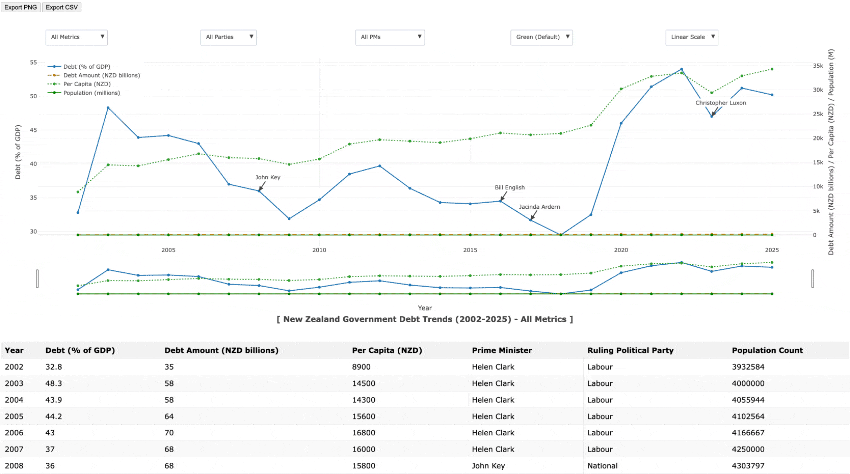

# New Zealand Government Debt Trends (2002-2025) - Interactive Graph

> New Zealand Government Debt Trends (2002-2025) with Metrics using [Plotly Open Source Graphing JS Library (Plotly Website)](https://plotly.com/graphing-libraries/) / [Plotly Open Source Graphing JS Library (Plotly GitHub)](https://github.com/plotly/plotly.js) charting generated with historical static data from various (28) reputable sources - *refer to data sources provided below table section*.
>
> [](https://github.com/badj/NZGovernmentsDebtTrends2002-2025/actions/workflows/pages/pages-build-deployment)
> 
> - View as an Interactive GitHub Pages-hosted page: [NZ Governments Debt Trends 2002-2025](https://badj.github.io/NZGovernmentsDebtTrends2002-2025/) or
> - View standalone HTML file in your browser:
>   - Download the [NZ_Governments Debt_Chart HTML file](https://github.com/badj/NZGovernmentsDebtTrends2002-2025/blob/main/NZ_DEBT_CHART-IT-plotlyJS-basic-minified-embed.html) - *with plotly.js (basic - minified) v1.58.5 embedded* → open HTML file in your browser.
>   - Download the [NZ_Governments Debt_Chart HTML file](https://github.com/badj/NZGovernmentsDebtTrends2002-2025/blob/main/NZ_DEBT_CHART-IT-plotlyJS-v1-58-5-embed.html) - *with plotly.js (not - minified) v1.58.5 embedded* → open HTML file in your browser.
>   - [NZ_Governments Debt_Chart HTML file](https://github.com/badj/NZGovernmentsDebtTrends2002-2025/blob/main/NZ_DEBT_CHART-IT-without-plotlyJS-embed.html) - *without plotly.js embedded: requires library download from CDN using the latest plotly.js* → Open in IDE and download the latest plotly.js from CDN.
> - The data table and all export options work directly in the browser.



> - Automated end-to-end testing has been integrated for the interactive visualization using [Playwright](https://playwright.dev/) as the test framework:
>   - The end-to-end tests verify the page and graph features, including dropdown filters, chart rendering, export options, and interactive controls.
>   - [Playwright MCP (Model Context Protocol)](https://github.com/microsoft/playwright-mcp) was used to [generate tests](.github/1-generate-tests.prompt.md) and to [fix failing tests](.github/2-fix-failing-tests.prompt.md) using [Claude Sonnet](https://www.anthropic.com/claude/sonnet) and [ChatGPT](https://chatgpt.com/) as agents for the prompts.
>
> [](https://github.com/badj/NZGovernmentsDebtTrends2002-2025/actions/workflows/main.yml)

---
### Table of contents

- [Overview](#overview)
- [Project information](#project-information)
- [Playwright Automated Testing](#playwright-automated-testing)
  - [Pre requisites](#pre-requisites)
  - [Setup](#setup)
  - [Run tests and generate the test run report to view test results](#run-tests-and-generate-the-test-run-report-to-view-the-test-results)
- [CICD Integration](#cicd-integration) 
- [TODO's](#todos)

---

### Overview

> Interactive Graph for New Zealand Government Debt Trends from 2002-2025 with metrics-supported features:

- **Scale Toggle Dropdown:**
  - A dropdown to switch between "Linear Scale" (default) and "Log Scale" for the right y-axis (Debt Amount, Per Capita, Population).
  - This affects only the secondary y-axis to handle the wide range of values (e.g., Debt Amount: 35–185B NZD, Per Capita: 8900–34300 NZD, Population: 3.9–5.4M).

- **Data Table graph views and dropdowns:**
  - The table is interactive and syncs with the chart’s filters (e.g., PM or Party filters adjust the table rows).
  - **Metrics Dropdown:** Toggle "All Metrics", "% GDP Only", "Amount Only", "Per Capita Only", "Population Only".
  - **Party Filter Dropdown:** Filter by "All Parties", "Labour Only", "National Only" (applies to debt metrics, not population).
  - **PM Filter Dropdown:** Filter by "All PMs", "Helen Clark", "John Key", "Bill English", "Jacinda Ardern", "Christopher Luxon".
  - **Population Colour Toggle Dropdown:** Options for "Green (Default)", "Orange", "Purple", "Hide Population".

- **Export Options:** "Export PNG" and "Export CSV" for downloading the graph image or data.
  - Buttons for the "Export Options" to toggle between a data table export (below the chart), exporting all columns (Year, Debt % GDP, Debt Amount, Per Capita, Prime Minister, Ruling Political Party, Population Count).
  - PNG: Downloads a high-resolution image (1200x750) via the "Export PNG" option.
  - CSV: Downloads a file (nz_government_debt_data.csv) with all table data.

- **Range Slider:** Zoom into specific year ranges (2002–2025).

- **Full hover tooltips:** All columns
  - Year
  - Debt % GDP
  - Amount
  - Per Capita
  - PM
  - Party
  - Population in millions

- **Party-based colouring:**
  - blue=Labour
  - red=National
  - for debt metrics, population in a separate colour.

- **PM change annotations:** Indicating PM change over.

- **The chart has four traces:** 
  - 0: % GDP
  - 1: Amount
  - 2: Per Capita
  - 3: Population in millions
 
---

### Project information

> [](https://github.com/badj/NZGovernmentsDebtTrends2002-2025/actions/workflows/pages/pages-build-deployment)
> 
> - View as an Interactive GitHub Pages-hosted page: [NZ Governments Debt Trends 2002-2025](https://badj.github.io/NZGovernmentsDebtTrends2002-2025/) or 
> - As a standalone HTML file in your browser locally:
>   - Download the [NZ_Governments Debt_Chart HTML file](https://github.com/badj/NZGovernmentsDebtTrends2002-2025/blob/main/NZ_DEBT_CHART-IT-plotlyJS-basic-minified-embed.html) - *with plotly.js (basic - minified) v1.58.5 embedded* → open HTML file in your browser. 
>   - Download the [NZ_Governments Debt_Chart HTML file](https://github.com/badj/NZGovernmentsDebtTrends2002-2025/blob/main/NZ_DEBT_CHART-IT-plotlyJS-v1-58-5-embed.html) - *with plotly.js (not - minified) v1.58.5 embedded* → open HTML file in your browser.
>   - [NZ_Governments Debt_Chart HTML file](https://github.com/badj/NZGovernmentsDebtTrends2002-2025/blob/main/NZ_DEBT_CHART-IT-without-plotlyJS-embed.html) - *without plotly.js embedded: requires library download from CDN using the latest plotly.js* → Open in IDE → download the latest plotly.js from CDN. 
> - The data table and all export options work directly in the browser.

---

### Playwright Automated Testing

> - Automated end-to-end testing has been integrated for the interactive visualization using [Playwright](https://playwright.dev/) as the test framework:
>   - The end-to-end tests verify the page and graph features, including dropdown filters, chart rendering, export options, and interactive controls.
>   - [Playwright MCP (Model Context Protocol)](https://github.com/microsoft/playwright-mcp) was used to [generate tests](.github/1-generate-tests.prompt.md) and to [fix failing tests](.github/2-fix-failing-tests.prompt.md) using [Claude Sonnet](https://www.anthropic.com/claude/sonnet) and [ChatGPT](https://chatgpt.com/) as agents for the prompts.
>
> - Playwright Key Test Coverage *(25 Tests)*:
>   - Visualization loads and displays correctly.
>   - All dropdowns contain expected filter options.
>   - Selecting filters updates the graph as expected.
>   - Export buttons (PNG, CSV) trigger downloads.
>   - Mode bar and chart controls are present and functional.
>   - Table Data and Data Sources are present and functional.
> 
> [](https://github.com/badj/NZGovernmentsDebtTrends2002-2025/actions/workflows/main.yml)

---

### Pre-requisites

1. [Node.js](https://nodejs.org/en/download/) (LTS version recommended)
2. [npm](https://docs.npmjs.com/downloading-and-installing-node-js-and-npm/) (Included with Node.js)

---
### Setup

1. Clone or Download
    - Clone this repository: `git clone https://github.com/badj/NZGovernmentsDebtTrends2002-2025.git`
    - Alternatively, download the ZIP file and extract it.
2. Navigate to Project Directory:
   ```bash
   cd NZGovernmentsDebtTrends2002-2025
   ```
3. Initialise a Node.js project
   ```bash
   npm init -y
   ```
4. Install Playwright
   ```bash
   npm i -D @playwright/test
   ```
5. Install browsers
   ```bash
   npx playwright install
   ``` 

---
### Run tests and generate the test run report to view the test results

**Test run with Playwright HTML report generation**

1. Execute the test (headless)
   ```bash
   npx playwright test
   ```
2. OR Execute the test (headed / browser opens)
   ```bash
   npx playwright test --headed
   ``` 
3. OR Execute the test with the UI
   ```bash
   npx playwright test --ui
   ``` 
4. View the HTML report when test execution completes - Command will print to the terminal
   ```bash
   npx playwright show-report
   ```
- A hyperlink to the webserver will be printed to the terminal that link through to the generated report - sample output:

  ```
  Serving HTML report at http://localhost:9323. Press Ctrl+C to quit.
  ```

---
### CICD Integration

> - **GitHub Actions/Workflows:**
>   - Automatically publishes the GitHub Page on every commit.
>   - Automatically runs Playwright tests on every commit and scheduled intervals.
> - **Test Reports:** HTML reports are generated for each run and uploaded as workflow artifacts.
> - **Trace & Video:** Retained on failure for debugging.

---

### TODO's:

1. Decrease test count after checking for duplicated coverage. 
2. Fix 3 failing test that are failing for Webkit and Firefox runs:
- All Dropdowns contain expected graph data filter options - Failing for Firefox runs!
- Visualization changes are handled - Failing for Webkit runs!
- Download options downloading as expected - Failing for Webkit runs!

---
