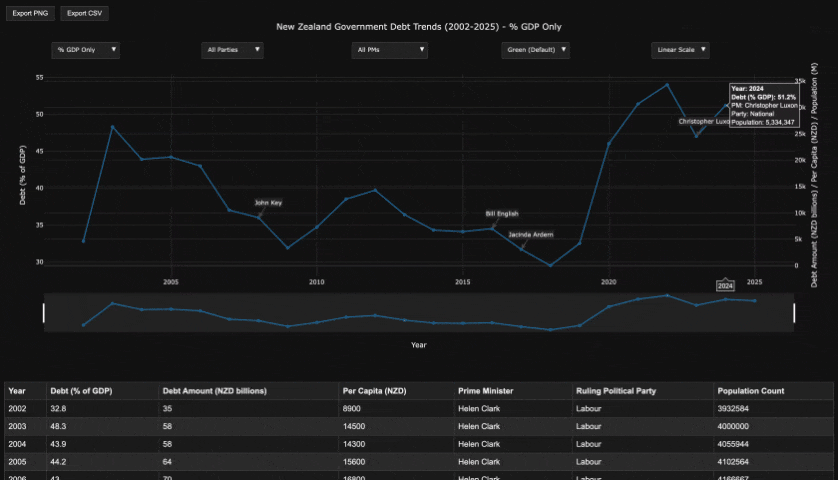

# New Zealand Government Debt Trends (2002-2025) - Interactive Graph

> New Zealand Government Debt Trends (2002-2025) with Metrics using [Plotly Open Source Graphing JS Library (Plotly Website)](https://plotly.com/graphing-libraries/) / [Plotly Open Source Graphing JS Library (Plotly GitHub)](https://github.com/plotly/plotly.js) to plot the graphs from historical static data from various sources *(refer to data sources provided below the data table)*.
>
> End-to-end test automation coverage has been implemented for the page using the [Playwright Test Framework](https://playwright.dev/) with initial tests generated/explored using [MCP(Model Context Protocol)](https://modelcontextprotocol.io/docs/getting-started/intro).
> 
> View the interactive page hosted on GitHub Pages: [NZ Governments Debt Trends 2002-2025](https://badj.github.io/NZGovDebtTrends2002-2025/)
> 
> **Demo samples of the interactive graph for Dark and Light themes:**
> 
> 
>
> 

---

### Table of contents

- [Overview](#overview)
- [Features of the Interactive Graph](#features-of-the-interactive-graph)
- [Playwright automated end-to-end tests](#playwright-automated-end-to-end-tests)
    - [Pre requisites](#pre-requisites)
    - [Setup](#setup)
    - [Run tests and generate the test run report to view test results](#run-tests-and-generate-the-test-run-report-to-view-the-test-results)
    - [Playwright MCP integration with Claude Sonnet and Chat-GPT agents](#playwright-mcp-integration-with-claude-sonnet-and-chat-gpt-agents)
      - [Configurations to enable Playwright MCP](#configurations-to-enable-playwright-mcp)
      - [Notes and observations during Playwright MCP agent usage](#notes-and-observations-during-playwright-mcp-agent-usage)
- [CICD Integration](#cicd-integration)
- [TODOs and Open Issues](#todos-and-open-issues)

---

### Overview

[](https://github.com/badj/NZGovDebtTrends2002-2025/actions/workflows/pages/pages-build-deployment)

> **View the interactive page hosted on GitHub Pages: [NZ Governments Debt Trends 2002-2025](https://badj.github.io/NZGovDebtTrends2002-2025/)**
> - **To view the standalone HTML file in your browser - Dark theme:**
>   - Download the [NZ_Governments Debt_Chart HTML file - Dark theme](https://github.com/badj/NZGovDebtTrends2002-2025/blob/main/NZ_DEBT_CHART-IT-plotlyJS-basic-minified-embed-Dark-theme.html) - *with plotly.js (basic - minified) v1.58.5 embedded* → open HTML file in your browser.
>   - Download the [NZ_Governments Debt_Chart HTML file - Dark theme](https://github.com/badj/NZGovDebtTrends2002-2025/blob/main/NZ_DEBT_CHART-IT-plotlyJS-v1-58-5-embed-Dark-theme.html) - *with plotly.js (not - minified) v1.58.5 embedded* → open HTML file in your browser.
>   - [NZ_Governments Debt_Chart HTML file - Dark theme](https://github.com/badj/NZGovDebtTrends2002-2025/blob/main/NZ_DEBT_CHART-IT-without-plotlyJS-embed-Dark-theme.html) - *without plotly.js embedded: requires library download from CDN using the latest plotly.js* → Open in IDE and download the latest plotly.js from CDN.
>
> - **To view the standalone HTML file in your browser - Light theme:**
 > - Download the [NZ_Governments Debt_Chart HTML file](https://github.com/badj/NZGovDebtTrends2002-2025/blob/main/NZ_DEBT_CHART-IT-plotlyJS-basic-minified-embed.html) - *with plotly.js (basic - minified) v1.58.5 embedded* → open HTML file in your browser.
>   - Download the [NZ_Governments Debt_Chart HTML file](https://github.com/badj/NZGovDebtTrends2002-2025/blob/main/NZ_DEBT_CHART-IT-plotlyJS-v1-58-5-embed.html) - *with plotly.js (not - minified) v1.58.5 embedded* → open HTML file in your browser.
>   - [NZ_Governments Debt_Chart HTML file](https://github.com/badj/NZGovDebtTrends2002-2025/blob/main/NZ_DEBT_CHART-IT-without-plotlyJS-embed.html) - *without plotly.js embedded: requires library download from CDN using the latest plotly.js* → Open in IDE and download the latest plotly.js from CDN.
> - The data table and all export options work directly in the browser.
>

---

> **Integrated Automated end-to-end testing:**
>
> [](https://github.com/badj/NZGovDebtTrends2002-2025/actions/workflows/main.yml)
>
> - Automated end-to-end testing has been integrated for the interactive visualisation using [Playwright](https://playwright.dev/) as the test framework:
> - The end-to-end tests verify the page and graph features, including dropdown filters, chart rendering, export options, and interactive controls.
> - [Playwright MCP (Model Context Protocol)](https://github.com/microsoft/playwright-mcp) was used with [GitHub Copilot](https://github.com/features/copilot), [Claude Sonnet](https://www.anthropic.com/claude/sonnet) and [Chat-GPT](https://chatgpt.com/) as agents for the prompts to [generate tests](.github/1-generate-tests.prompt.md) and for [fixing failing tests](.github/2-fix-failing-tests.prompt.md).

[_⇡ Return to the Table of Contents_](#table-of-contents)

---

### Features of the Interactive Graph

> Interactive Graph for New Zealand Government Debt Trends from 2002-2025 with metrics-supported features


- **Scale Toggle Dropdown:**
  - A dropdown to switch between "Linear Scale" (default) and "Log Scale" for the right y-axis (Debt Amount, Per Capita, Population).
  - This affects only the secondary y-axis to handle the wide range of values (e.g., Debt Amount: 35–185B NZD, Per Capita: 8900–34300 NZD, Population: 3.9–5.4M).


- **Data Table graph views and dropdowns:**
  - The table is interactive and syncs with the chart’s filters (e.g., PM or Party filters adjust the table rows).
  - **Metrics Dropdown:** Toggle "All Metrics", "% GDP Only", "Amount Only", "Per Capita Only", "Population Only".
  - **Party Filter Dropdown:** Filter by "All Parties", "Labour Only", "National Only" (applies to debt metrics, not population).
  - **PM Filter Dropdown:** Filter by "All PMs", "Helen Clark", "John Key", "Bill English", "Jacinda Ardern", "Christopher Luxon".
  - **Population Colour Toggle Dropdown:** Options for "Green (Default)", "Orange", "Purple", "Hide Population".

  
- **Export Options:** "Export PNG" and "Export CSV" for downloading the graph image or data.
  - Buttons for the "Export Options" to toggle between a data table export (below the chart), exporting all columns (Year, Debt % GDP, Debt Amount, Per Capita, Prime Minister, Ruling Political Party, Population Count).
  - PNG: Downloads a high-resolution image (1200x750) via the "Export PNG" option.
  - CSV: Downloads a file (nz_government_debt_data.csv) with all table data.


- **Range Slider:** Zoom into specific year ranges (2002–2025).


- **Full hover tooltips:** All columns
  - Year
  - Debt % GDP
  - Amount
  - Per Capita
  - PM
  - Party
  - Population in millions


- **Party-based colouring:**
  - blue=Labour
  - red=National
  - for debt metrics, population in a separate colour.


- **PM change annotations:** Indicating PM change over.


- **The chart has four traces:** 
  - 0: % GDP
  - 1: Amount
  - 2: Per Capita
  - 3: Population in millions

[_⇡ Return to the Table of Contents_](#table-of-contents)

---

### Playwright automated end-to-end tests

[](https://github.com/badj/NZGovDebtTrends2002-2025/actions/workflows/main.yml)

- **Automated end-to-end testing has been integrated for the interactive visualisation using [Playwright](https://playwright.dev/) as the test framework:**
   - The end-to-end tests verify the page and graph features, including dropdown filters, chart rendering, export options, and interactive controls.
   - [Playwright MCP (Model Context Protocol)](https://github.com/microsoft/playwright-mcp) was used with [GitHub Copilot](https://github.com/features/copilot), [Claude Sonnet](https://www.anthropic.com/claude/sonnet) and [Chat-GPT](https://chatgpt.com/) as agents for the prompts to [generate tests](.github/1-generate-tests.prompt.md) and for [fixing failing tests](.github/2-fix-failing-tests.prompt.md).


 - **Playwright Key Test Coverage** *(25 Tests)*:
   - Visualisation loads and displays correctly.
   - All dropdowns contain expected filter options.
   - Selecting filters updates the graph as expected for plotting and page chart content.
   - Export buttons (PNG, CSV) trigger downloads.
   - Mode bar and chart controls are present and functional.
   - Table Data and Data Sources are present and functional.

[_⇡ Return to the Table of Contents_](#table-of-contents)

---

### Pre-requisites

1. [Node.js](https://nodejs.org/en/download/) (LTS version recommended)
2. [npm](https://docs.npmjs.com/downloading-and-installing-node-js-and-npm/) (Included with Node.js)

[_⇡ Return to the Table of Contents_](#table-of-contents)

---
### Setup

1. Clone or Download the repo:

- Clone this repository:
   ```bash
   git clone https://github.com/badj/NZGovDebtTrends2002-2025.git
   ```
- Alternatively, download the ZIP file and extract it.

2. Navigate to Project Directory:
   ```bash
   cd NZGovDebtTrends2002-2025
   ```
3. Initialise a Node.js project
   ```bash
   npm init -y
   ```
4. Install Playwright
   ```bash
   npm i -D @playwright/test
   ```
5. Install browsers
   ```bash
   npx playwright install
   ``` 

[_⇡ Return to the Table of Contents_](#table-of-contents)

---
### Run tests and generate the test run report to view the test results

> Test run with Playwright HTML report generation

1. Execute the test (headless)
   ```bash
   npx playwright test
   ```
2. OR Execute the test (headed / browser opens)
   ```bash
   npx playwright test --headed
   ``` 
3. OR Execute the test with the UI
   ```bash
   npx playwright test --ui
   ```
4. OR Execute the test (headless) with increased workers to speed up the test run
   ```bash
   npx playwright test --workers=10
   ``` 
5. View the HTML report when test execution completes: ```show-report``` command prints to the terminal
   ```bash
   npx playwright show-report
   ```
- Terminal output sample of a successful test run
  ```terminaloutput
  NZGovDebtTrends2002-2025 (main) % npx playwright test --workers=10
  
  Running 25 tests using 10 workers
  25 passed (9.2s)
  
  To open the HTML report, run:
  
  npx playwright show-report
  ```

[_⇡ Return to the Table of Contents_](#table-of-contents)

---

### Playwright MCP integration with Claude Sonnet and Chat-GPT agents

> - Usage of [Playwright MCP (Model Context Protocol)](https://github.com/microsoft/playwright-mcp) to generate a Playwright project that explores your site, write your Tests, and iterate until all tests pass.
> - Playwright MCP in Agent Mode can autonomously navigate your app, discover key functionality, and generate runnable tests — *in some cases, no manual scripting required.*
> - [GitHub Copilot](https://github.com/features/copilot) was set to use [Claude Sonnet](https://www.anthropic.com/claude/sonnet) and [Chat-GPT](https://chatgpt.com/) as agents in Agent mode.

[_⇡ Return to the Table of Contents_](#table-of-contents)

---

### Configurations to enable Playwright MCP

1. Configure the MCP Playwright server to run locally inside the  [IDE project folder](.idea/mcp.json) in a file called ```mcp.json``` *([IntelliJ IDEA / Webstorm](https://www.jetbrains.com/webstorm/) was used for this project)*

   ```JSON
   {
     "servers": {
       "playwright": {
         "command": "npx",
         "args": ["@playwright/mcp@latest"]
       }
     }
   }
   ```

2. In the project IDE folder [an autoApprove settings file was added](.idea/settings.json) called ```settings.json```

- By adding this code, no 'click to continue' is required each time, allowing the agent to continue on its own.

  ```JSON
  {
  "chat.tools.autoApprove": true
  }
  ```

3. Prepare test prompts and add the prompt Markdown to the ```.github``` folder

- For this project, the prompt Markdown file: [1-generate-tests](.github/1-generate-tests.prompt.md) was used to create the initial Playwright tests.
- For this project, a second prompt Markdown file: [2-fix-failing-tests](.github/2-fix-failing-tests.prompt.md) was used to continue fixing and updating generated Playwright tests further.

4. In the IDE, use Agent Mode, add the prompt to the context to create the initial tests and iterate until all tests pass.

- Agent mode uses the Playwright MCP to navigate to the site and uses the browser to explore the website like a real user.
- Prompts instruct the agent to navigate, discover functionality, and then generate tests automatically based on its interactions.
- The initial/first prompt used for Playwright MCP to start autonomously: 

   ```terminaloutput
   Explore https://badj.github.io/NZGovDebtTrends2002-2025/
   ```

- This generated the bulk of the tests, allowing me to tweak it further to my preferences and expectations.
- After wrapping up the interactions, the agent summarises its findings and can continue to update and fix the tests if required.

5. Test Generation & Execution:
  
> The agent generates a full Playwright test file based on the interactions, and it fixes errors automatically before running each iteration of the tests.

- Once generated, it opens a terminal and runs the tests. When it passes, you can / should inspect the steps taken to confirm accuracy and check for false positives. 
- It’s a full cycle where Playwright MCP: explores → generates the tests → executes the tests → reviews the results of the test run. 
- **For best results:** Iterate and refine the prompts to increase the test coverage and prompt the agent to explore additional areas as well.

[_⇡ Return to the Table of Contents_](#table-of-contents)

---

### Notes and observations during Playwright MCP agent usage

>- Approximately 70% of the tests were created and fixed smoothly with [GitHub Copilot](https://github.com/features/copilot) set to use [Claude Sonnet 3.5](https://www.anthropic.com/claude/sonnet) and [Chat-GPT 4.1](https://chatgpt.com/) as agents using [Playwright MCP](https://github.com/microsoft/playwright-mcp).
>- Nurturing/Manual effort to fix and refactor some of the failing and passing tests was necessary, when the MCP agent missed the mark!

[_⇡ Return to the Table of Contents_](#table-of-contents)

---

### CICD Integration

- **GitHub Actions/Workflows:**
    - GitHub Action/Workflow implemented to [publish the GitHub Page](https://github.com/badj/NZGovDebtTrends2002-2025/actions/workflows/pages/pages-build-deployment) on every commit.
    - GitHub Action/Workflow implemented to [run Playwright tests](https://github.com/badj/NZGovDebtTrends2002-2025/actions/workflows/main.yml) on every commit and scheduled intervals.
- **Test Reports:**
    - HTML reports are generated for each run and uploaded as workflow artefacts.
- **Test run configurations:**
    - workers: 10
    - retries: 3
    - trace: retain-on-failure
    - screenshot: only-on-failure
    - video: retain-on-failure
    - cron schedule: 7:30 am NZT (UTC+12)

[_⇡ Return to the Table of Contents_](#table-of-contents)

---

### TODOs and Open Issues

> The following enhancements and bugs are tracked as issues in the [GitHub Open Issues](https://github.com/badj/NZGovDebtTrends2002-2025/issues)

**Enhancements:**

1. [Add toggle to set page to Dark or Light theme](https://github.com/badj/NZGovDebtTrends2002-2025/issues/7)
2. [Decrease the test count after analysing tests for duplicated coverage.](https://github.com/badj/NZGovDebtTrends2002-2025/issues/2)

**Bugs:**

1. [Enable WebKit and Firefox cross-browser runners when 4 failing tests are fixed for the specific browsers encountering failures](https://github.com/badj/NZGovDebtTrends2002-2025/issues/1)


[_⇡ Return to the Table of Contents_](#table-of-contents)

---
